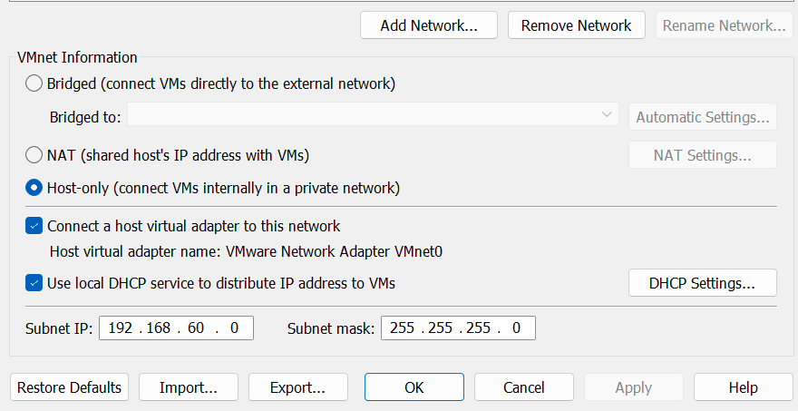
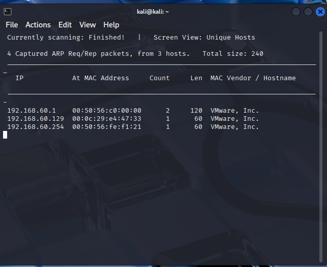
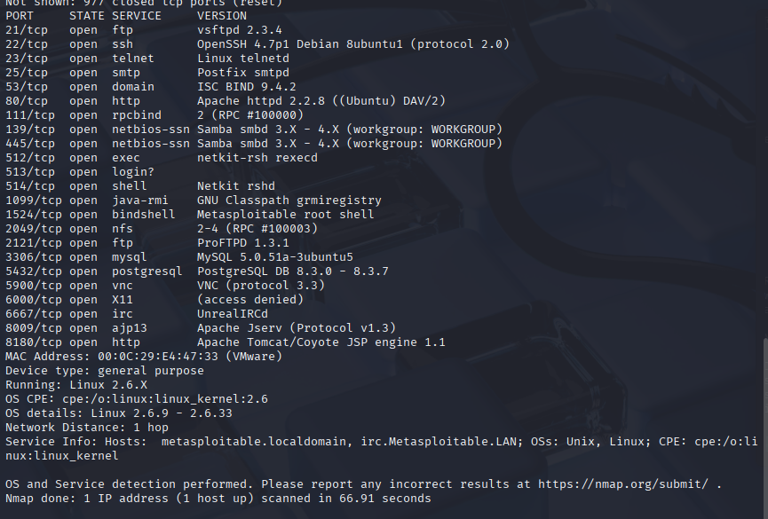
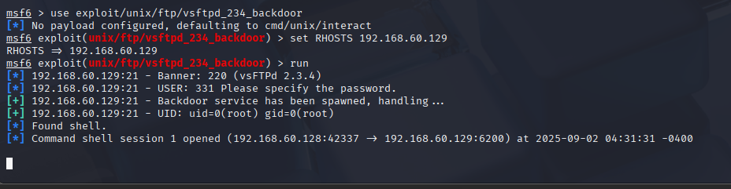

# Enumeration + Fingerprinting

## Installation
Die beiden VMs habe ich von den jeweiligen Webseiten heruntergeladen. Beide VMs sind prebuilt um Zeit zu sparen.
In VMWare habe ich das VMNet0 genommen und Host-Only gemacht. Die Netzadresse habe ich auf 192.168.60.0 festgelegt.


## Auftrag
### Discover und NMap
Zuerst habe ich ein Netdiscover gemacht:
```
sudo netdiscover –r 192.168.60.0/24
```
Dabei sind folgende Geräte rausgekommen:


192.168.60.1 ist mein Laptop der als Firewall fungiert. Der 129er ist die Metasploit VM.
Mit dem Normalen NMap Scan fand ich heraus dass die folgenden Ports offen sind:


Wenn ich jetz auch den OS NMap ausführe sehe ich ganz genau auch alle Versionen und das OS:


Den UDP Scan habe ich auch durchgeführt, jedoch hat der so lange gebraucht das ich ihn schliesslich gestoppt habe.

### Exploit
Um alle Exploits anzusehen kann man auf der Kali VM im Terminal "msfconsole" eingeben. Damit kommt man in die MSF Konsole. Um die Exploits anzuzeigen braucht man "show exploits". Das gibt alle verfügbaren Exploits aus die es gibt. Sucht man nach einem bestimmten Modul kann man "search" benutzen.<br> 
Ich habe mich für den UnrealIRCd 3.2.8.1 Backdoor Exploit und den VSFTPD 2.3.4 Backdoor Exploit entschieden. Beide ergeben eine Remote Shell.<br>

Um den Exploit auszusuchen nimmt man den "use" Command. Ausserdem muss man den Remote Host bzw. das Ziel festlegen. Das wird mit "RHOSTS" gemacht. Somit wäre das der ganze Befehl:
```
use exploit/unix/ftp/vsftpd_234_backdoor
set RHOSTS 192.168.60.129
run
```
So sieht es dann aus:

Jetzt kann ich alles in der Shell ausführen was der Normale Benutzer auch könnte. Ich habe z.B. die Metasploit VM schon per Remote neugestartet. <br>

Quellen:<br>


### Massnahmen
Offensichtlich sollte man keine Ports offen haben die nicht gebraucht werden, also offene Ports schliessen und auch nicht gebrauchte Dienste deaktivieren. Ausserdem sollte man immer auf die neusten Updates installieren, da in den meisten Updates die Lücke schon geschlossen wurde. Man kann auch den Zugriff im Netzwerk mit Segmentierung beschränken um solch einen Angiff zu verhindern.